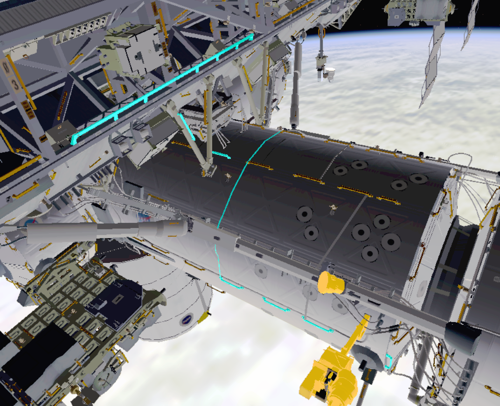

# EVANav
Navigation for space walks

## GENERAL CONCEPT
Imagine using Google Maps and Navigation, but as a space walker on the Space Station.

Flight controllers and astronauts at NASA use a 3D model of the International Space Station (ISS) to aid in the planning and execution of ExtraVehicular Activity (EVA, or "space walks"). This model (named "DOUG") includes all of the modules and hardware on ISS as well as each handrail used by an EVA crew member to aid in translation. Determining the "best" path from one location on ISS to another is currently done by trained, experienced humans. This project is to use computing power to aid those humans.

The user interface should allow for selection of start and end points, each different handrails. The user may also choose options for the route. The default will be the shortest route, but the user may want the route that encounters the least amount of hazards (sharp edges, radiating hardware, articulating structures, shatterable materials, etc), a route that deconflicts their partner's route (EVAs are performed by a pair of crew), a route including one or more waypoints in the middle of the route, and/or a route with the fewest number of rotations and plane changes. The user may also choose to enter the value for the crew member's wingspan. This is important in places where handrails are spaced farther apart than some people's reach limit.

The algorithm will then calculate the ideal route and output the results. The basic output should be a sequential list of handrail numbers and the distance between each pair of handrails along the path. A long term goal is to output the results in a way that DOUG can read so the path can be highlighted and centered in the viewing frame.

## EXAMPLE OF ALTERNATE ROUTES
Suppose an EV crew member is on the starboard/forward edge of the Lab and needs to translate to S0 forward. The two images below show alternate paths. One may be more direct, but it forces the crew member to translate near sensitive hardware. The other path goes around the sensitive hardware, but may take longer.

In this path, the crew member must maneuver around the sensitive hardware highlighted in yellow:

In this path, the crew member is routed away from the sensitive hardware, but the path is longer:

## REQUIREMENTS & ASSUMPTIONS
1. For this project, assume only handrails can be used to aid in translation (though it is common for EV crew to use structural beams in places where handrails are sparse).
1. UI should include start and end points
1. UI should allow optional waypoints in the middle of the route
1. UI should allow for two simultaneous routes (one for each crew member)
1. UI should allow options for route determination
   1. Avoid crew hazards (things that hurt the crew or their suit)
   1. Avoid hardware hazards (things that could by hurt by the crew)
   1. Deconflict partner's route (don't use the same handrails)
   1. Minimize rotations and plane changes (movement from one face to another around a module)
   1. Field to enter crew member's wingspan
1. Output should include sequential list of handrail numbers, including distance between each pair of handrails
1. Output should be in a format readable by DOUG

## OUTPUT FORMAT
Ideally the model should be represented using nodes on a graph (a scene-graph). Each node in the graph would contain a transformation of the frame that its model and child nodes would be relative to.  The following is a sample of how a scene-graph for a simple camera model could be defined and is actually a format that DOUG can read.  In DOUG all units are in inches and degrees.

The following is a sample:

    camera_A
    SYSTEM
    0 0 0
    0 0 0
    NULL
        camera_pan_A
        camera_pan_model.stl
        0 0 0
        0 0 0
        camera_A
            camera_tilt_A
            camera_model.stl
            0 0 2.0
            0 0 0
            camera_pan_A

The indentation is not required but is included above to show the relationship between the nodes.

DOUG uses a right-handed coordinate system where <pitch> is rotation about the 'Y-axis', <yaw> is rotation about the 'Z-axis' and <roll> is about the 'X-axis' and is typically applied in Pitch-Yaw-Roll order.

Each node is represented with 5 consecutive lines of text in the file with the following format.

    <unique_node_name>
    <geometry_file_name> or "SYSTEM"
    <x> <y> <z>
    <pitch> <yaw> <roll>
    <parent_node_name> or "NULL"

## SAMPLE DATA
* LAB_S0_geometry.stl     - Contains a text based data format of the geometry of the US Lab and S0 truss of the ISS
* Handrails/
  * LABHANDHOLDS/           - Contains Lab handrails as STL files
  * LABHANDHOLDS.str        - Struct file containing xyz/PYR of each handrail on Lab
  * S0HANDHOLDS/            - Contains S0 truss handrails as STL files
  * S0HANDHOLDS.str         - Struct file containing xyz/PYR of each handrail on S0 truss

The .str files contain the location and orientation information for each handrail, saved with 5 lines.

* NodeName
* Modelname
* x y z
* pitch yaw roll
* ParentNode

## RELATED WORK
See [ISSMaps](https://github.com/darenwelsh/ISSMaps), my first attempt at this. I didn't get very far, but it may be helpful.

See [NASA Path Finder](https://github.com/lovetostrike/nasa-path-finder), a project by graduate students in the University of Maryland University College Software Engineering (SWEN 670) course to implement this idea.
